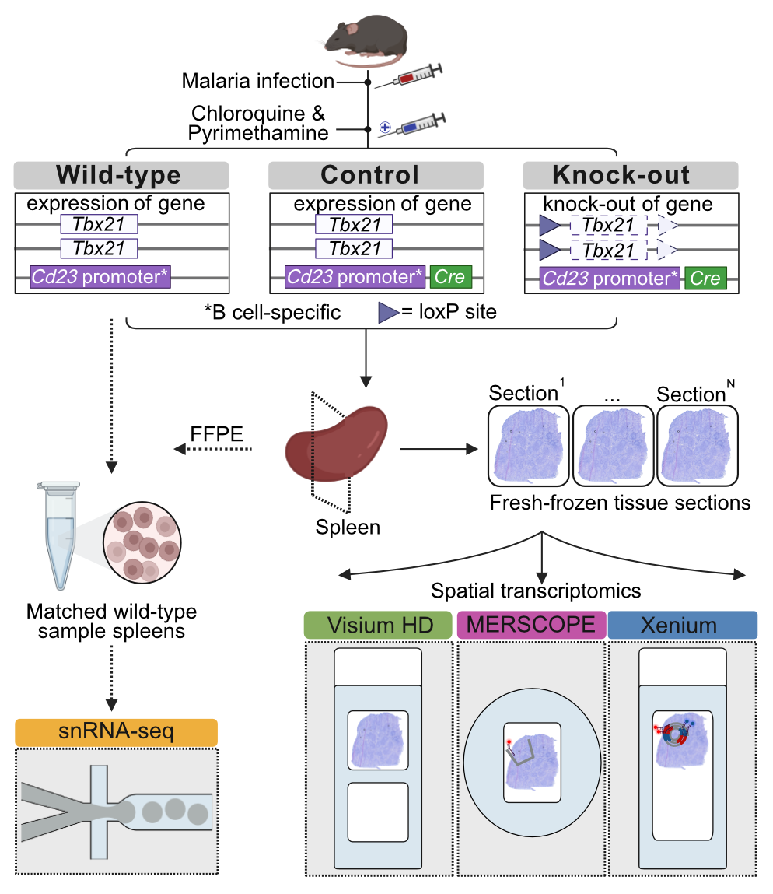

  

<h1 align="center">SpatialBench: Comparative cross-platform benchmarking of high-resolution spatial transcriptomics using matched mouse lymphoid tissue</h1>

## Contents
- [Introduction](#introduction)
- [Applications](#applications)
- [Data Availability](#data-availability)
- [Workflows](#workflows)
- [Citation](#citation)
- [Acknowledgements](#acknowledgements)

## Introduction

Spatial transcriptomics (ST) has rapidly expanded with the introduction of multiple high-resolution platforms, yet cross-platform benchmarking remains limited and largely focused on technical performance. SpatialBench is a matched multi-platform resource comprising Visium HD, Xenium and MERSCOPE data together with single-cell and single-nucleus references from a malaria-challenged wild-type and B cell-specific *Tbx21* knockout mouse spleen model. We systematically evaluate ST platform performance using technical and biological readouts, providing a biologically defined reference dataset for evaluation of ST technologies, method development, and computational benchmarking.

  

## Applications

Some example applications of the SpatialBench dataset include:

- **Cross-platform benchmarking** of segmentation accuracy, sensitivity, and transcript capture across Xenium, MERSCOPE, and Visium HD.
- **Method development and evaluation** for cell segmentation, cell typing, spatial domain detection, and differential abundance analysis in high-resolution ST data.
- **Studying germinal centre biology** including B cell differentiation, *Tbx21* knockout effects, and spatially resolved immune organisation in mouse spleen.
- **Reference dataset for computational tools** requiring matched multi-platform ST data with accompanying single-cell and single-nucleus RNA-seq references.

## Data Availability

The **SpatialBench dataset** is publicly deposited at BioStudies
([S-BSST2361](https://ftp.ebi.ac.uk/pub/databases/biostudies/S-BSST/361/S-BSST2361/)).

### Imaging-based spatial data

| Batch | Technology | Condition | Sample ID |
|-------|------------|-----------|-----------|
| batch 1 | 10X Xenium | Wild Type | [WT713](https://ftp.ebi.ac.uk/pub/databases/biostudies/S-BSST/361/S-BSST2361/Files/Xenium/WT713) |
| batch 2 | 10X Xenium | Wild Type | [WT709-rep1](https://ftp.ebi.ac.uk/pub/databases/biostudies/S-BSST/361/S-BSST2361/Files/Xenium/WT709-rep1) |
| batch 2 | 10X Xenium | Wild Type | [WT710-rep1](https://ftp.ebi.ac.uk/pub/databases/biostudies/S-BSST/361/S-BSST2361/Files/Xenium/WT710-rep1) |
| batch 3 | 10X Xenium | Wild Type | [WT709-rep2](https://ftp.ebi.ac.uk/pub/databases/biostudies/S-BSST/361/S-BSST2361/Files/Xenium/WT709-rep2) |
| batch 3 | 10X Xenium | Wild Type | [WT710-rep2](https://ftp.ebi.ac.uk/pub/databases/biostudies/S-BSST/361/S-BSST2361/Files/Xenium/WT710-rep2) |
| batch 1 | 10X Xenium | Control | [Ctrl173-rep1](https://ftp.ebi.ac.uk/pub/databases/biostudies/S-BSST/361/S-BSST2361/Files/Xenium/Ctrl173-rep1) |
| batch 2 | 10X Xenium | Control | [Ctrl172-rep1](https://ftp.ebi.ac.uk/pub/databases/biostudies/S-BSST/361/S-BSST2361/Files/Xenium/Ctrl172-rep1) |
| batch 2 | 10X Xenium | Control | [Ctrl174-rep1](https://ftp.ebi.ac.uk/pub/databases/biostudies/S-BSST/361/S-BSST2361/Files/Xenium/Ctrl174-rep1) |
| batch 3 | 10X Xenium | Control | [Ctrl172-rep2](https://ftp.ebi.ac.uk/pub/databases/biostudies/S-BSST/361/S-BSST2361/Files/Xenium/Ctrl172-rep2) |
| batch 3 | 10X Xenium | Control | [Ctrl173-rep2](https://ftp.ebi.ac.uk/pub/databases/biostudies/S-BSST/361/S-BSST2361/Files/Xenium/Ctrl173-rep2) |
| batch 3 | 10X Xenium | Control | [Ctrl174-rep2](https://ftp.ebi.ac.uk/pub/databases/biostudies/S-BSST/361/S-BSST2361/Files/Xenium/Ctrl174-rep2) |
| batch 1 | 10X Xenium | Knock Out | [KO166](https://ftp.ebi.ac.uk/pub/databases/biostudies/S-BSST/361/S-BSST2361/Files/Xenium/KO166) |
| batch 1 | 10X Xenium | Knock Out | [KO167](https://ftp.ebi.ac.uk/pub/databases/biostudies/S-BSST/361/S-BSST2361/Files/Xenium/KO167) |
| batch 2 | 10X Xenium | Knock Out | [KO168](https://ftp.ebi.ac.uk/pub/databases/biostudies/S-BSST/361/S-BSST2361/Files/Xenium/KO168) |
| batch 13 | MERSCOPE | Wild Type | [WT709](https://ftp.ebi.ac.uk/pub/databases/biostudies/S-BSST/361/S-BSST2361/Files/MERSCOPE/WT709/WT709) |
| batch 13 | MERSCOPE | Wild Type | [WT710](https://ftp.ebi.ac.uk/pub/databases/biostudies/S-BSST/361/S-BSST2361/Files/MERSCOPE/WT710) |
| batch 13 | MERSCOPE | Wild Type | [WT713](https://ftp.ebi.ac.uk/pub/databases/biostudies/S-BSST/361/S-BSST2361/Files/MERSCOPE/WT713) |
| batch 6 | MERSCOPE | Control | [Ctrl174a](https://ftp.ebi.ac.uk/pub/databases/biostudies/S-BSST/361/S-BSST2361/Files/MERSCOPE/Ctrl174a) |
| batch 9 | MERSCOPE | Control | [Ctrl173](https://ftp.ebi.ac.uk/pub/databases/biostudies/S-BSST/361/S-BSST2361/Files/MERSCOPE/Ctrl173) |
| batch 10 | MERSCOPE | Control | [Ctrl172](https://ftp.ebi.ac.uk/pub/databases/biostudies/S-BSST/361/S-BSST2361/Files/MERSCOPE/Ctrl172) |
| batch 6 | MERSCOPE | Knock Out | [KO166b](https://ftp.ebi.ac.uk/pub/databases/biostudies/S-BSST/361/S-BSST2361/Files/MERSCOPE/KO166b) |
| batch 9 | MERSCOPE | Knock Out | [KO168](https://ftp.ebi.ac.uk/pub/databases/biostudies/S-BSST/361/S-BSST2361/Files/MERSCOPE/KO168) |
| batch 10 | MERSCOPE | Knock Out | [KO167](https://ftp.ebi.ac.uk/pub/databases/biostudies/S-BSST/361/S-BSST2361/Files/MERSCOPE/KO167) |

### Sequencing-based data

| Batch | Technology | Condition | Sample ID |
|-------|------------|-----------|-----------|
| batch 1 | 10X Visium HD | Wild Type | [WT709](https://ftp.ebi.ac.uk/pub/databases/biostudies/S-BSST/361/S-BSST2361/Files/VisiumHD/WT709.tar.gz) |
| batch 1 | 10X Visium HD | Wild Type | [WT713](https://ftp.ebi.ac.uk/pub/databases/biostudies/S-BSST/361/S-BSST2361/Files/VisiumHD/WT713.tar.gz) |
| batch 1 | 10X Visium HD | Knock Out | [KO167](https://ftp.ebi.ac.uk/pub/databases/biostudies/S-BSST/361/S-BSST2361/Files/VisiumHD/KO167.tar.gz) |
| batch 1 | 10X Visium HD | Knock Out | [KO168](https://ftp.ebi.ac.uk/pub/databases/biostudies/S-BSST/361/S-BSST2361/Files/VisiumHD/KO168.tar.gz) |
| batch 29 | 10X Chromium | Wild Type | [WT709](https://www.ncbi.nlm.nih.gov/geo/query/acc.cgi?acc=GSM8047887) |
| batch 29 | 10X Chromium | Wild Type | [WT713](https://www.ncbi.nlm.nih.gov/geo/query/acc.cgi?acc=GSM8047887) |

## Workflows

The following analysis workflows are available in this repository. Each folder contains its own README with full usage instructions.

- [**VisiumHD_DE_analysis/**](VisiumHD_DE_analysis/) — `targets`-based R pipeline for Visium HD analysis. Covers per-sample preprocessing, BANKSY spatial neighbourhood embedding, RCTD cell type deconvolution, GC B cell subclustering into Dark Zone and Light Zone subpopulations, and limma-voom pseudobulk differential expression.

- [**iST_pipeline/**](iST_pipeline/) — Snakemake pipeline for Xenium and MERSCOPE imaging-based ST data. Covers Seurat object creation from raw platform output across multiple segmentation methods (default, Cellpose, Proseg), BANKSY + Harmony joint embedding and batch correction, cluster annotation, GC B cell subclustering, and pseudobulk differential expression. Supports named sub-targets for running individual platforms or pipeline stages on the HPC via SLURM.

## Citation

If you use the SpatialBench dataset or workflows, please cite:

Ashleigh N. Solano, Raymond K. H. Yip, Changqing Wang, Daniela Amann-Zalcenstein,
Pradeep Rajasekhar, Ishrat Zaman, Allan Motyer, Marek Cmero, Yang Xu, Yining Pan,
Casey J. A. Anttila, Stephanie I. Studniberg, Peter F. Hickey, Layla Wang,
Callum J. Sargeant, Ling Ling, Yunshun Chen, Ruvimbo D. Mishi, Lisa J. Ioannidis,
Kim L. Good-Jacobson, Hamish W. King, Kelly L. Rogers, Diana S. Hansen,
Rory Bowden, Matthew E. Ritchie.
SpatialBench: Comparative cross-platform benchmarking of high-resolution spatial transcriptomics using matched mouse lymphoid tissue.
*bioRxiv* 2026.04.29.721531; doi: [https://doi.org/10.64898/2026.04.29.721531](https://doi.org/10.64898/2026.04.29.721531)

## Acknowledgements

We thank the WEHI Advanced Genomics Facility, Center for Dynamic Imaging and
Advanced Histotechnology facility for supporting the generation and analysis of
single-cell and spatial transcriptomics data for this project.

---
